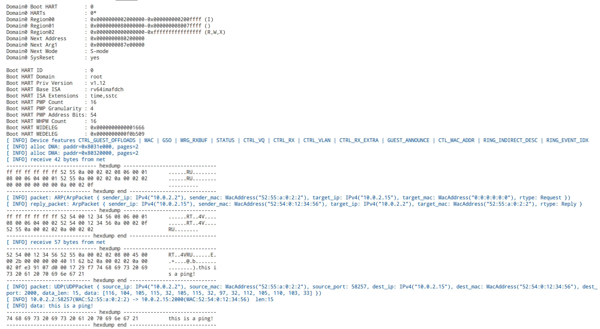

# net example

## Environment

> 以下环境可正常运行(其他自行测试)

- OS: EndeavourOS
- arch: X86
- qemu: qemu 7.2.0

## 运行结果



## 运行

打开一个中断执行 ping 程序 (请确保安装有 python3)

```
make ping
```

然后在另一个中断中执行程序即可

```
make run
```